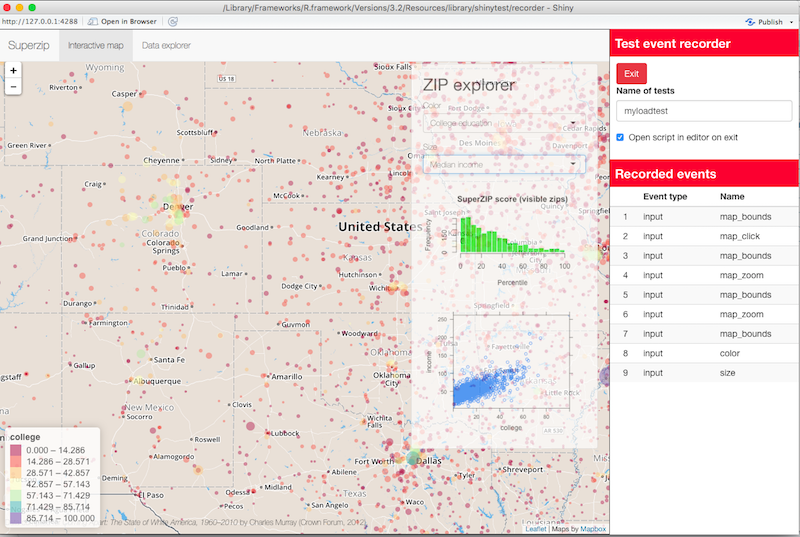
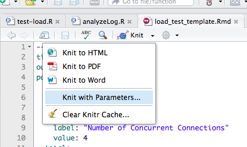

# shinyloadtest
[](https://travis-ci.org/rstudio/shinyloadtest)


This package extends the [shinytest package](https://github.com/rstudio/shinytest) to enable users to load test deployed Shiny applications. Load testing is executed using parallel phantomJS sessions.

## Installation

Currently, `shinyloadtest` is available on Github:

```r
devtools::install_github("rstudio/shinyloadtest")
```

You will also need to install `shinytest` and `phantomJS`. `shinytest` includes a helper function to install the latest version of `phantomJS`.


## Record Test

To get started, record a test using the `shinytest` package's recorder with `load_mode` enabled. The test should be reflective of expected application use. For more details, see the [`shinytest` documentation](https://rstudio.github.io/shinytest/). Tests must be recorded against a local copy of the deployed application.

```r
library(shinytest)
recordTest("path/to/app", load_mode = TRUE)
```



The recorder will save interactions with the application and timing information into a R file. For example, the following script was generated for the [superzip application](http://shiny.rstudio.com/gallery/superzip-example.html).

```r
app <- ShinyLoadDriver$new()
app$snapshotInit("myloadtest")

app$setInputs(size = "college")
Sys.sleep(3.1)
app$setInputs(threshold = 6)
Sys.sleep(0.5)
app$setInputs(threshold = 7)
Sys.sleep(1.4)
app$setInputs(threshold = 8)
Sys.sleep(0.0)
app$setInputs(threshold = 7)
Sys.sleep(8.4)
app$setInputs(nav = "Data explorer")
Sys.sleep(0.4)
app$setInputs(states = "CO")
Sys.sleep(1.5)


app$snapshot()
app$stop()
app$getEventLog()

```

The components of the test script unique to `load_mode` are:

```r
app <- ShinyLoadDriver$new() # enables the load test of a deployed app

Sys.sleep()                  # records user pauses between inputs

app$snapshot()               # takes a screenshot of the application
app$stop()                   # disconnects from the application
app$getEventLog()            # returns the event log with timing information
```

## Running Load Tests

One way to run a load test against the deployed application is to use the `loadTest` function.

```r
library(shinyloadtest)  
loadTest(testFile = 'myloadTest.R',
         url = 'https://beta.rstudioconnect.com/content/2551',
         numConcurrent = 8,
         numTotal = 16,
         loadTimeout = 5,
         stagger = 4, 
         phantomTimeout = 20)
```

This function uses the `parallel` and `foreach` packages to open concurrent R processes. Each R process uses phantomJS to run the recorded test against the deployed application.

`numConcurrent` is the number of concurrent connections to the application.

`numTotal` is the total number of tests run against the application.

`loadTimeout` is the maximum amount of seconds to wait for the Shiny app to load.

`stagger` adds a random delay of up to `stagger` seconds to the concurrent connections. 

`phantomTimeout` is the maximum seconds to wait for the phantomJS process to start.

**WARNING** Load testing a large number of concurrent connections will open a large number of processes on the client computer. Use with caution.

The `loadTest` function returns an event log that contains timing and event information for each visit to the application. The package includes functions for analyzing the event log such as `getSuccesses`, `getErrors`, `getMaxConcurrent`, `getPageLoadTimes`, and others. 


## Running Load Test Reports

The package includes a R Markdown report that runs a load test and a baseline test and compares the results. To access the report, use:

```r
createLoadTestReport("/directory/for/report", "nameOfReport.Rmd")
```

The report is parameterized to accept inputs such as the application URL and the desired number of concurrent connections.  To run the report, open the report and then select `Knit with Parameters` from within RStudio:




Alternatively, use the R Markdown `knit_params_ask` function. For example:

```r
report <- createLoadTestReport("/directory/for/report", "nameOfReport.Rmd")
report %>% 
  knit_params_ask() %>% 
  render(report, params = .)
```

You will be prompted to enter the parameters for your load test:


**WARNING** This report can take a long time to render and will generate multiple processes on the client machine. Use with caution. 

In addition to running the load test, this report will establish a baseline by running the test script for 1 concurrent connection multiple times. The report can be edited as necessary. The logs for the baseline test and the load test are saved to RDS files alongside the R Markdown file and HTML output.


## [Example Report Output](https://beta.rstudioconnect.com/content/2554/load_test_template.html)


## Use Cases

`shinyloadtest` is best suited for testing applications with 20-60 concurrent connections. Driving more load on the deployed appliction is possible, but may require a server to act as the client. 

We recommend using `shinyloadtest` to experiment with application performance and tuning. For more details see: [Performance Tuning for Shiny Server Pro](https://support.rstudio.com/hc/en-us/articles/220546267-Scaling-and-Performance-Tuning-Applications-in-Shiny-Server-Pro), [Performance Tuning for RStudio Connect](https://support.rstudio.com/hc/en-us/articles/231874748), and [Performance Tuning for shinyapps.io](http://shiny.rstudio.com/articles/scaling-and-tuning.html).


